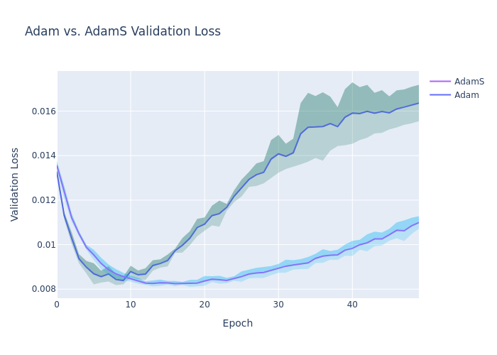

# AdamS Experiment

## Hypothesis

The learning rate of an optimizer should be dynamically adjusted for each parameter based on the historical stability of its gradient's sign. If a gradient consistently points in the same direction, its corresponding parameter can afford a larger learning rate. Conversely, if the gradient sign oscillates, the learning rate should be reduced to prevent overshooting and improve convergence.

## Methodology

To test this hypothesis, a new optimizer called **AdamS** (Adam with Sign-based Stability) was implemented. AdamS modifies the standard Adam optimizer by adding a new state variable for each parameter: a moving average of the signs of its gradients. This "sign stability" term is then used to modulate the effective learning rate for each parameter.

A simple Multi-Layer Perceptron (MLP) was trained on the `mnist1d` dataset. To ensure a fair comparison, the `Optuna` library was used to independently tune the hyperparameters for both the standard Adam optimizer and the new AdamS optimizer. The performance of both optimizers was then compared based on the minimum validation loss achieved over 5 runs with different random seeds.

## Results

The Optuna study found the following best hyperparameters:
- **Adam:** `{'lr': 0.0064869134988384146}`
- **AdamS:** `{'lr': 0.007636813749109747, 'sign_beta': 0.9586434189315427}`

The validation loss curves for the final comparison are shown below:

As the plot shows, both optimizers achieve a very similar final validation loss. AdamS appears to have a slightly lower mean validation loss, but the difference is well within the standard deviation of the runs.

## Conclusion

The hypothesis that modulating the learning rate based on gradient sign stability would improve performance is not strongly supported by this experiment. While AdamS did not perform worse than Adam, it also did not provide a significant improvement. The additional complexity of the AdamS optimizer does not seem to be justified by the results on this particular task.
