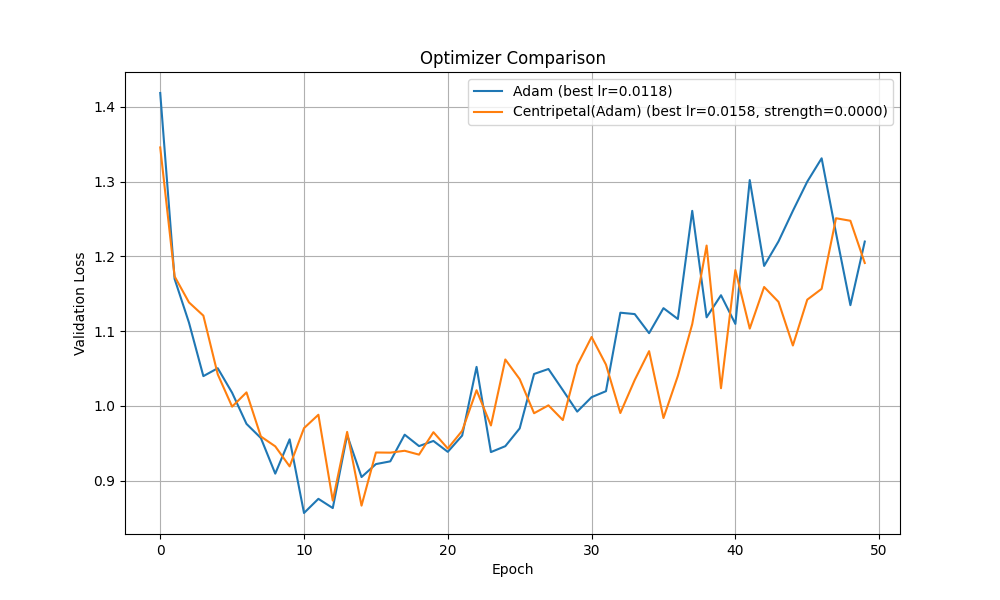

# Centripetal Optimizer Experiment

This experiment introduces and evaluates a novel optimizer called the "Centripetal Optimizer." The core idea is to add a regularization term directly into the optimization step, which pulls the weights of each layer towards their collective mean.

## Hypothesis

The central hypothesis is that applying a "centripetal force" to each layer's parameters during training will act as a form of regularization. By encouraging weights to cluster around their mean, we might reduce the model's internal complexity, prevent individual weights from becoming excessively large, and ultimately improve generalization and lead to a lower validation loss compared to a standard optimizer.

## Methodology

1.  **Optimizer Implementation**: A PyTorch optimizer named `CentripetalOptimizer` was implemented in `optimizer.py`. This optimizer is a wrapper around a base optimizer (in this case, `torch.optim.Adam`). After the base optimizer performs its update, the `CentripetalOptimizer` applies an additional update to each parameter tensor, nudging each weight towards the mean of all weights in its tensor. The magnitude of this pull is controlled by a `strength` hyperparameter.

2.  **Comparison Setup**: The `compare.py` script was created to benchmark the performance of `CentripetalOptimizer(Adam)` against the standard `Adam` optimizer on the `mnist1d` dataset using a simple MLP model.

3.  **Fairness**: To ensure a fair comparison, both optimizers started with identical initial model weights. Crucially, `optuna` was used to tune the relevant hyperparameters for each optimizer independently.
    *   For `Adam`, the `learning_rate` was tuned.
    *   For `CentripetalOptimizer`, both the `learning_rate` and the `strength` of the centripetal force were tuned.

## Results

The hyperparameter tuning process ran for 20 trials for each optimizer. The best parameters found were:
*   **Adam**: `learning_rate = 0.0118`
*   **CentripetalOptimizer(Adam)**: `learning_rate = 0.0158`, `strength = 0.0000`

The most significant result from the tuning is that the optimal `strength` for the Centripetal Optimizer was found to be effectively zero. This indicates that the hyperparameter search concluded that the best performance was achieved when the centripetal force was completely turned off.

The performance of both optimizers using their tuned hyperparameters is shown below:

As the plot shows, the validation loss curves for both optimizers are very similar, which is expected since the tuned Centripetal Optimizer had a strength of zero, making it functionally identical to the standard Adam optimizer.

## Conclusion

The hypothesis that applying a centripetal force to weights during optimization would improve generalization is **not supported** by the results of this experiment.

The `optuna` hyperparameter search effectively nullified the novel component of the `CentripetalOptimizer` by setting its `strength` to zero. This demonstrates that, for this model and dataset, adding this specific type of regularization directly within the optimizer provided no benefit and was discarded in favor of the standard Adam update rule. The experiment highlights the importance of rigorous, fair comparison, as a naive implementation without hyperparameter tuning might have led to misleading conclusions.
