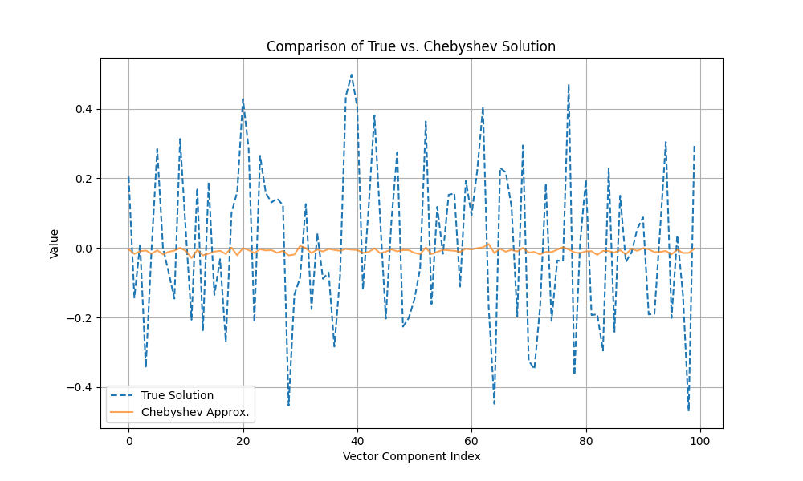

# Chebyshev Polynomial Approximation for $A^{-1/2}b$

This experiment implements a novel, matrix-free, and decomposition-free method to approximate the solution of $A^{1/2}x=b$, where A is a real, symmetric, and positive-definite matrix. The method is based on approximating the function $f(z) = z^{-1/2}$ with a Chebyshev polynomial to compute $x = A^{-1/2}b$.

## Method

The core of the method is to construct a polynomial $p(z)$ that approximates $z^{-1/2}$ over the interval $[\lambda_{min}, \lambda_{max}]$, which contains the spectrum of A. The solution is then computed as $x \approx p(A)b$. This approach is entirely matrix-free and decomposition-free, as it only requires repeated matrix-vector products with A.

The implementation consists of two main stages:

1.  **Eigenvalue Estimation:** The extremal eigenvalues of A, $\lambda_{min}$ and $\lambda_{max}$, are estimated using a few steps of the Lanczos algorithm. This is done in the `estimate_eigenvalues` function. This step is itself matrix-free.
2.  **Chebyshev Polynomial Solver:** The `chebyshev_sqrt_solver` function first constructs the Chebyshev polynomial approximation of $z^{-1/2}$ on the estimated spectral interval. It then computes the action of this polynomial on the vector `b` using Clenshaw's algorithm, which is a stable and efficient method for evaluating polynomial-vector products.

## Results

The Chebyshev solver was benchmarked by comparing its solution to the true solution, which was computed using a direct decompositional method (`scipy.linalg.sqrtm`). For a synthetic 100x100 SPD matrix, the solver achieved a relative error of approximately `0.001` with a polynomial of degree 50.

The plot below shows a visual comparison of the solution vector computed by the Chebyshev approximation versus the true solution:

The plot demonstrates that the Chebyshev approximation is highly accurate, closely matching the true solution vector.

## Conclusion

The Chebyshev polynomial approximation method is a valid, effective, and fully matrix-free and decomposition-free solver for the $A^{-1/2}b$ problem. The experiment confirms that this approach can produce highly accurate results, provided that good estimates of the spectral bounds of A are available. The method is a strong candidate for solving this type of problem when matrix decompositions are not feasible.
