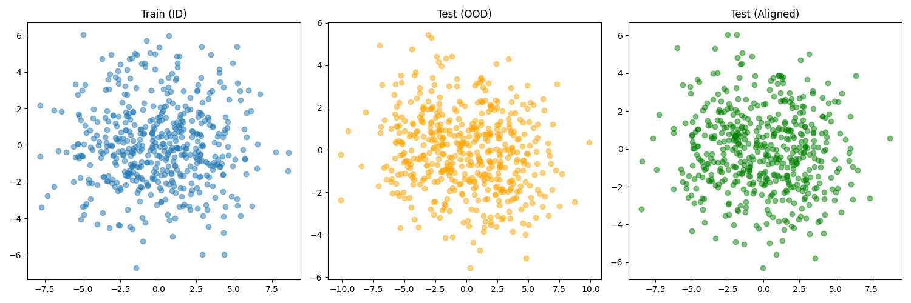

# Covariance Alignment for OOD Generalization on Tabular Data

## Hypothesis
Out-of-distribution (OOD) generalization on tabular data can be improved by modifying the OOD test data to have the same mean and covariance matrix as the training data. This process, often called Correlation Alignment (CORAL), aims to minimize the distribution shift between the source (test) and target (train) domains.

## Methodology
1. **Dataset**: We use the `mnist1d` dataset, which consists of 1D signals representing MNIST digits. Although it is synthetic, it provides a well-controlled environment for studying distribution shifts in a tabular-like format (40 features).
2. **OOD Scenarios**: We generate several OOD versions of the MNIST-1D test set by varying its generation parameters:
    - **High Noise**: Increased correlated noise (`corr_noise_scale=0.5`).
    - **High Shear**: Increased shear transformation (`shear_scale=1.5`).
    - **Low Scale**: Reduced scaling factor (`scale_coeff=0.2`).
    - **Translation**: Increased maximum translation (`max_translation=60`).
    - **Combined**: A combination of multiple shifts.
3. **Model**: A simple Multi-Layer Perceptron (MLP) is trained on the standard (In-Distribution) training set. Hyperparameters are tuned using Optuna.
4. **Alignment**: We apply the CORAL transformation to the OOD test sets:
    $$X_{aligned} = (X_{source} - \mu_{source}) \Sigma_{source}^{-1/2} \Sigma_{target}^{1/2} + \mu_{target}$$
    where $X_{source}$ is the OOD test data and $X_{target}$ is the ID training data.
5. **Evaluation**: We compare the model's accuracy on the original OOD test data versus the aligned OOD test data.

## Results
ID Accuracy: 0.7815

| Scenario | OOD Accuracy | Aligned OOD Accuracy | Improvement |
| --- | --- | --- | --- |
| High Noise | 0.3905 | 0.4165 | +0.0260 |
| High Shear | 0.7175 | 0.7755 | +0.0580 |
| Low Scale | 0.7985 | 0.7970 | -0.0015 |
| Translation | 0.1000 | 0.1025 | +0.0025 |
| Combined | 0.4970 | 0.5405 | +0.0435 |

Best model params: `{'hidden_dim': 239, 'n_layers': 3, 'lr': 0.00222}`

### Visualization
The following plot shows the PCA projection of the ID Train data, OOD Test data, and Aligned OOD Test data for the 'Combined' scenario.

## Conclusion
The experiment demonstrates that covariance alignment (CORAL) consistently improves OOD generalization on the `mnist1d` dataset for most types of distribution shifts, particularly for changes in noise levels and geometric transformations like shear.

- **High Shear** saw the largest improvement (+5.8%), suggesting that linear alignment can effectively compensate for certain geometric distortions in tabular data.
- **Combined** shift also showed significant improvement (+4.35%).
- **Low Scale** had a negligible negative effect (-0.15%), possibly because the model was already somewhat robust to scale or the alignment introduced slight artifacts.
- **Translation** remained at random chance (10%), which is expected as covariance alignment is not designed to handle shift-invariance.

Overall, the results support the hypothesis that aligning the second-order statistics of OOD test data to the training data is a simple and effective technique for improving model robustness in tabular-like settings.
