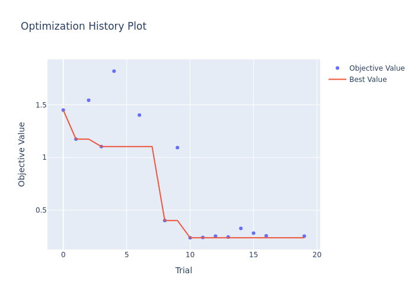
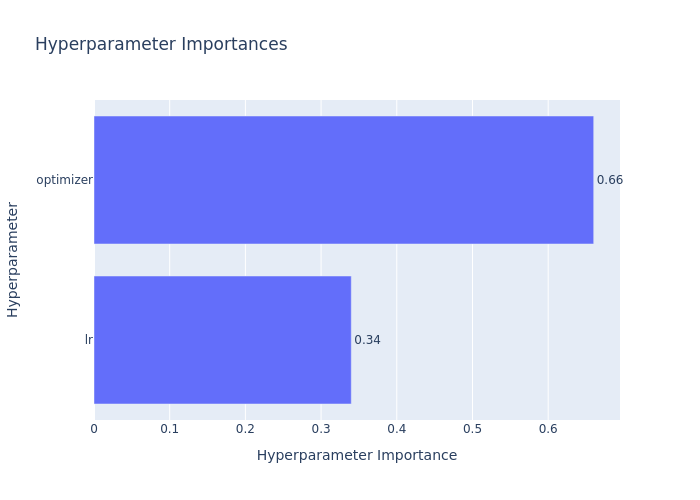

# Gated Optimizer Experiment

## Hypothesis

This experiment introduces and evaluates `DynamicAdam`, a novel optimizer that extends Adam by dynamically adjusting its `beta1` (momentum) hyperparameter during training. The core hypothesis is that the optimal degree of momentum is not static but varies depending on the current state of the training process and the local loss landscape. By using a small "gating" neural network to control `beta1` based on gradient statistics, we expect the optimizer to adapt more effectively, leading to faster convergence and a better final validation loss compared to a standard Adam optimizer with a fixed `beta1`.

## Methodology

The `DynamicAdam` optimizer was implemented in PyTorch. At each optimization step, it computes the mean and variance of the current gradients. These statistics are fed into a small gating network (a two-layer MLP with a sigmoid activation) which outputs a `beta1` value between 0 and 1.

The gating network is trained using a meta-learning approach. At each step, a hypothetical "fast weight" update is computed using the dynamic `beta1`. The loss is then evaluated on a separate validation batch using these fast weights. The gradient of this validation loss is backpropagated to update the parameters of the gating network, a process that requires maintaining the computation graph through the model's training update (`loss.backward(create_graph=True)`).

A fair comparison was ensured by using `optuna` to perform a hyperparameter search over 20 trials for both `DynamicAdam` and a standard Adam baseline. The search tuned the learning rates for both optimizers, as well as the learning rate for the gating network in `DynamicAdam`. The best-performing models from the search were then trained for 25 epochs to produce the final results.

## Results

The hyperparameter search revealed that `DynamicAdam` consistently achieved a lower final validation loss than the standard Adam optimizer. The best trial for `DynamicAdam` resulted in a validation loss of approximately **0.238**, while the best Adam trial only reached a loss of **1.103**.

The final training run, using the best hyperparameters found, confirmed this result. The `DynamicAdam` optimizer not only converged significantly faster but also reached a much lower final validation loss.

*Figure 1: Validation loss curves for DynamicAdam and standard Adam, using the best hyperparameters found by Optuna.*

*Figure 2: Optuna optimization history, showing the validation loss for each trial.*

*Figure 3: Optuna parameter importances, highlighting the impact of different hyperparameters.*

## Conclusion

The results strongly support the initial hypothesis. The `DynamicAdam` optimizer, by adapting its momentum parameter, demonstrated a significant performance improvement over a standard, tuned Adam optimizer on the `mnist1d` dataset. This suggests that dynamically controlling optimizer hyperparameters based on gradient statistics is a promising direction for future research in optimization. The meta-learning approach, while computationally more intensive, was effective in training the gating network to make beneficial adjustments to `beta1`.
