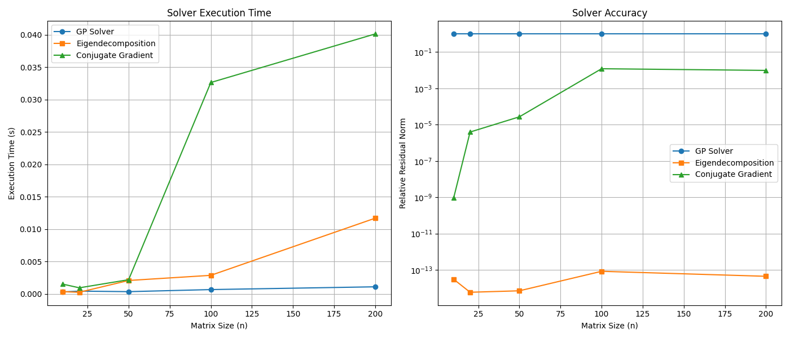

# Genetic Programming for Matrix Square Root Solver

This experiment aimed to discover a matrix-free and decomposition-free iterative solver for the linear system $A^{1/2}x = b$, where $A$ is a symmetric positive-definite (SPD) matrix, using genetic programming (GP).

## Methodology

A tree-based genetic programming system was developed to evolve mathematical expressions representing iterative updates of the form $x_{k+1} = f(A, b, x_k)$. The components of the GP system were:

- **Terminals:** `x` (the current iterate), `b` (the right-hand side vector).
- **Operators:** `+`, `-`, `*` (element-wise), and `A*` (matrix-vector product with A).
- **Fitness Function:** The fitness of a candidate solver was evaluated based on the final residual norm $\|x_{true} - x_N\|$, where $x_{true} = A^{-1/2}b$ and $N=25$ is the number of iterations. The fitness was averaged over several randomly generated SPD matrices.
- **Evolution:** A population of solvers was evolved over 20 generations using tournament selection, crossover, and mutation.

The best-evolved solver from the GP training phase was then benchmarked against two standard methods:
1. **Eigendecomposition:** A direct method that computes $A^{-1/2}$ via the eigendecomposition of A.
2. **Conjugate Gradient (CG):** An iterative method applied to the transformed system $Ax = A^{1/2}b$.

The comparison was performed on random SPD matrices of increasing size, from 10x10 to 200x200.

## Evolved Solver

The best solver discovered by the genetic programming algorithm was:
`x_k+1 = (x - ((b + x) * (x - (A*((x * b)) * x))))`

## Results

The performance of the solvers was measured in terms of execution time and final relative residual norm, $\|A^{1/2}x - b\| / \|b\|$.

### Analysis

- **Accuracy:** The GP-evolved solver failed to converge to the correct solution. Its residual norm remained at 1.0, indicating it made no progress from the initial guess of $x_0=0$. In contrast, both eigendecomposition and Conjugate Gradient achieved high accuracy, with residuals on the order of $10^{-14}$ and $10^{-3}$ to $10^{-9}$, respectively.

- **Execution Time:** The GP solver was very fast, but its speed is irrelevant due to its complete lack of accuracy. The eigendecomposition method was the fastest for small matrices, while CG became more competitive as the matrix size increased.

## Conclusion

The experiment was unsuccessful in finding a viable solver for $A^{1/2}x = b$ through genetic programming. The evolved expressions, while syntactically valid, did not represent convergent iterative methods. This suggests that the search space of simple mathematical expressions is not well-suited for discovering complex numerical algorithms like this, or that the fitness landscape is too difficult for a simple GP system to navigate effectively. The strong performance of established methods like CG highlights the difficulty of discovering such sophisticated algorithms automatically.
