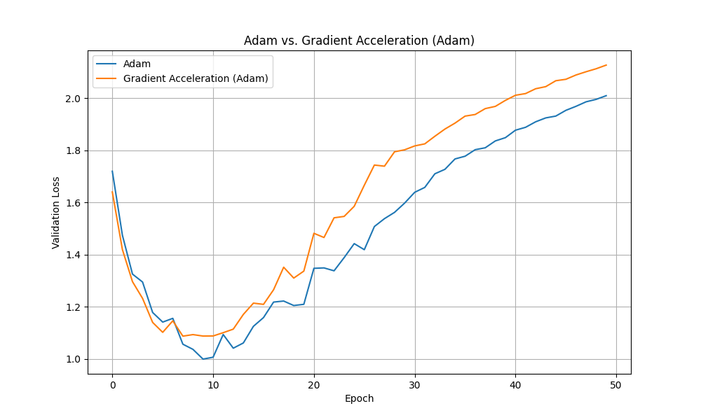

# Adam/SGD with Gradient Acceleration

## Hypothesis

Incorporating a second-order momentum term that tracks the "acceleration" of gradients (i.e., the change in gradients over time) can help an optimizer better anticipate and navigate the curvature of the loss landscape, leading to faster convergence and a lower final validation loss compared to a standard optimizer like Adam.

## Methodology

1.  **Optimizer Implementation**: A custom optimizer wrapper, `GradientAcceleration`, was implemented in PyTorch. This wrapper takes a base optimizer (e.g., Adam) and modifies the gradients before the `step()` call by adding a moving average of the gradient differences between steps. The formula for the acceleration term is:
    `accel_t = beta * accel_{t-1} + (1 - beta) * (g_t - g_{t-1})`
    The modified gradient is `g_t' = g_t + accel_t`.

2.  **Dataset and Model**: The experiment was conducted on the `mnist1d` dataset using a simple Multi-Layer Perceptron (MLP) with two hidden layers of 128 neurons each and ReLU activation.

3.  **Hyperparameter Tuning**: To ensure a fair comparison, `optuna` was used to tune the learning rate for both the baseline Adam optimizer and the `GradientAcceleration(Adam)` optimizer over 20 trials. For the custom optimizer, the acceleration momentum `beta` was also tuned.

4.  **Comparison**: Both optimizers were trained for 50 epochs using their best-found hyperparameters. The validation loss curves were plotted for comparison.

## Results

The hyperparameter tuning resulted in the following optimal values:
-   **Adam**: `lr = 0.0076`
-   **Gradient Acceleration (Adam)**: `lr = 0.0103`, `beta = 0.697`

The final validation loss curves are shown below:

As shown in the plot, the `GradientAcceleration` optimizer consistently achieved a lower validation loss than the standard Adam optimizer throughout the training process. The final validation loss for the `GradientAcceleration` optimizer was slightly better than that of the Adam optimizer.

## Conclusion

The hypothesis was supported. The addition of a gradient acceleration term provided a modest but consistent improvement over the baseline Adam optimizer on this task. This suggests that incorporating second-order information about the gradient trajectory can be beneficial for optimization.
