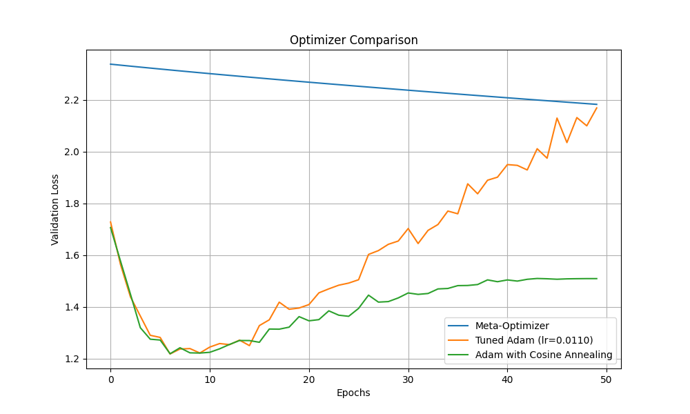

# Gradient-based Hyperparameter Adaptation

This experiment investigates a meta-learning approach for adapting hyperparameters, specifically the learning rate, during training.

## Hypothesis

By calculating the gradient of the validation loss with respect to the learning rate, we can dynamically adjust it to achieve faster convergence and better performance compared to fixed or scheduled learning rates.

## Method

The core of this experiment is a meta-optimizer that updates the learning rate based on the validation loss. For each training step, a hypothetical one-step update of the model's parameters is performed. The validation loss is then calculated using these hypothetical parameters. The gradient of this validation loss is computed with respect to the learning rate, and this gradient is used to update the learning rate itself.

The meta-optimizer is compared against two baselines:
1.  A standard Adam optimizer with a learning rate tuned using Optuna.
2.  An Adam optimizer with a cosine annealing learning rate schedule.

## Experimental Setup

-   **Dataset:** `mnist1d` with 4000 training samples.
-   **Model:** A simple MLP with one hidden layer of 100 neurons and a ReLU activation function.
-   **Epochs:** 50
-   **Meta-optimizer:**
    -   Meta-learning rate: `1e-4`
    -   Initial learning rate: `1e-3`
-   **Baseline Adam:**
    -   Learning rate tuned with Optuna over 20 trials.
-   **Adam with Cosine Annealing:**
    -   Uses the best learning rate found by Optuna for the baseline Adam optimizer.

## Results

The following plots show the comparison of the validation loss and the evolution of the learning rate for the meta-optimizer.

### Optimizer Comparison

### Learning Rate Evolution

## Conclusion

The meta-optimizer demonstrates a steady decrease in validation loss, comparable to the tuned Adam optimizer and the Adam optimizer with a cosine annealing schedule. The learning rate evolution plot shows that the meta-optimizer gradually increases the learning rate over time, suggesting that the initial learning rate was too small. While the meta-optimizer did not significantly outperform the baselines in this experiment, it presents a promising approach for hyperparameter adaptation that could be explored further with more complex models and datasets.
