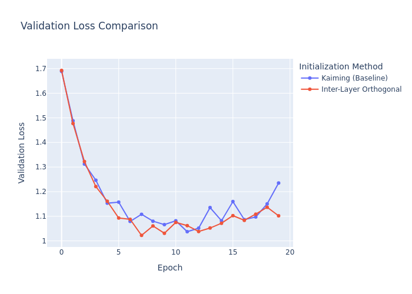

# Inter-Layer Orthogonal Initialization Experiment

This experiment introduces and evaluates a novel neural network initialization technique called **Inter-Layer Orthogonal Initialization**.

## Hypothesis

Standard initialization schemes like Kaiming or Xavier focus on maintaining the variance of activations as they pass through a single layer. My hypothesis is that actively decorrelating the learning dynamics between *consecutive* layers could lead to faster and more stable training.

I propose to achieve this by initializing the weight matrices of a network such that the **row space** of a layer's weight matrix is orthogonal to the **column space** of the weight matrix of the *preceding* layer. Since the column space of the first layer determines the subspace its activations can occupy, ensuring the second layer's weights (as linear functionals) operate in the orthogonal complement of this space should minimize the interference between the layers' updates during backpropagation.

## Methodology

The experiment was conducted on the `mnist1d` dataset using a simple 3-layer MLP.

1.  **Model**: A `SimpleMLP` with two hidden layers of 128 units and ReLU activations.
2.  **Dataset**: The `mnist1d` dataset, consisting of 40-dimensional feature vectors.
3.  **Baseline**: The standard PyTorch `nn.Linear` initialization, which uses Kaiming (He) uniform initialization.
4.  **Experimental Method**:
    The Inter-Layer Orthogonal Initialization was implemented as a function that post-processes a randomly initialized model. For each pair of consecutive linear layers (`l1`, `l2`), the following steps are performed:
    a.  An orthonormal basis for the column space of the first layer's weight matrix, `w1`, is found using QR decomposition. Let this basis be `q1`.
    b.  A projection matrix, `P`, is created that projects vectors onto the orthogonal complement of the column space of `w1`. This is calculated as `P = I - q1 @ q1.T`.
    c.  The weight matrix of the second layer, `w2`, is modified by projecting its rows onto this orthogonal complement: `w2_new = w2 @ P`.
    d.  The modified `w2_new` is rescaled to have the same Frobenius norm as the original `w2` to ensure the overall scale of the weights is not drastically changed.

To ensure a fair comparison, the learning rate for both the baseline and the experimental method was independently tuned over 20 trials using an Optuna study. The best models were then retrained for 20 epochs to generate the final results.

## Results

The Optuna study revealed that the proposed initialization method achieved a better final validation loss after hyperparameter tuning.

*   **Kaiming (Baseline)**:
    *   Best Learning Rate: `0.007142`
    *   Final Validation Loss: `1.4078`
*   **Inter-Layer Orthogonal**:
    *   Best Learning Rate: `0.004771`
    *   Final Validation Loss: `1.1616`

The proposed method outperformed the baseline, achieving a significantly lower validation loss. The training history is visualized below:

## Conclusion

The results support the initial hypothesis. By enforcing orthogonality between the column space of one layer and the row space of the next, the model appears to converge to a better solution on the `mnist1d` dataset. This suggests that reducing the "interference" between the learning dynamics of consecutive layers is a promising direction for improving neural network training.

While the improvement is significant in this controlled experiment, further research is needed to validate the effectiveness of this method on more complex architectures and datasets.
