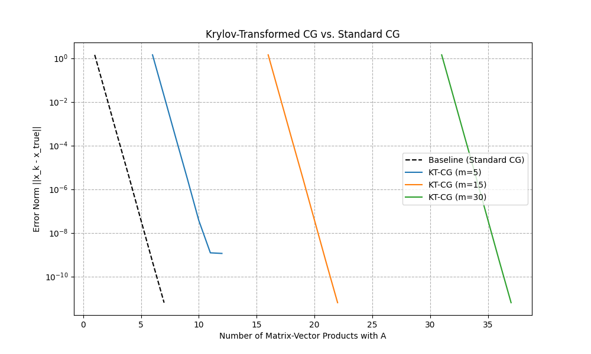

# Experiment: Krylov-Transformed CG Solver for $A^{1/2}x=b$

This experiment introduces and evaluates a novel, matrix-free method for solving the linear system $A^{1/2}x=b$, where $A$ is a symmetric positive-definite (SPD) matrix. The proposed method, named the **Krylov-Transformed Conjugate Gradient (KT-CG)** solver, aims to provide a stable and efficient alternative to existing techniques.

## Hypothesis

Standard methods often tackle the system $A^{1/2}x=b$ by solving the transformed system $Ax=A^{1/2}b$. This requires computing the matrix-vector product $A^{1/2}b$, which can be computationally expensive. Previous experiments, like the Lanczos-CG solver, showed that approximating the operator $A^{1/2}$ inside the Conjugate Gradient (CG) loop can lead to instability and stagnating convergence.

The hypothesis of this experiment is that it is more stable and efficient to first approximate the right-hand side vector, creating $\hat{b} \approx A^{1/2}b$, and then solve the standard linear system $Ax=\hat{b}$ using the highly robust conventional CG algorithm. This approach isolates the approximation to a single, up-front step, preventing the accumulation of errors inside the iterative solver.

## Method: KT-CG Solver

The KT-CG algorithm consists of two main stages:

1.  **Krylov Subspace Approximation of the Right-Hand Side:**
    -   A Lanczos iteration is performed for `m` steps with the matrix `A` and the initial vector `b` to generate an orthonormal basis `Q` and a tridiagonal matrix `T` that form a Krylov subspace.
    -   This subspace provides a high-quality, low-dimensional approximation: $A \approx Q T Q^T$.
    -   The matrix square root is then approximated as $A^{1/2} \approx Q T^{1/2} Q^T$.
    -   The target vector $A^{1/2}b$ is approximated as $\hat{b} = Q T^{1/2} Q^T b$. Since `b` is the starting vector for the Lanczos iteration, $Q^T b$ is simply `(norm(b), 0, ..., 0)`.

2.  **Standard Conjugate Gradient:**
    -   The standard, unmodified CG algorithm is used to solve the linear system $Ax = \hat{b}$.

This method is "matrix-free" because it only requires a function that computes the matrix-vector product `Av`, which is provided as a `LinearOperator`.

## Experimental Setup

-   **Problem:** A 256x256 random SPD matrix `A` was generated. A true solution vector, $x_{\text{true}}$, was created, and the right-hand side was calculated as $b = A^{1/2}x_{\text{true}}$.
-   **Baseline:** The standard method of solving the transformed system $Ax = A^{1/2}b$ (where $A^{1/2}b$ is computed to high precision) using SciPy's `cg` solver.
-   **Metrics:** Performance was measured by the error norm, $\|x_k - x_{\text{true}}\|$, plotted against the total number of matrix-vector products with `A`.
-   **Parameters:** The KT-CG solver was tested with Krylov subspace dimensions of $m \in \{5, 15, 30\}$.

## Results

**The hypothesis was confirmed.** The KT-CG solver is stable, converges efficiently, and demonstrates a clear trade-off between the quality of the initial approximation and the final achievable accuracy.

### Key Findings:

1.  **Stability and Convergence:** The KT-CG method is numerically stable and converges smoothly, validating the approach of separating the approximation step from the iterative solver.
2.  **Performance Trade-off:** The accuracy of the final solution is directly determined by the dimension `m` of the Krylov subspace. A larger `m` results in a better approximation of the right-hand side, allowing the CG solver to reach a lower final error. This comes at the cost of more matrix-vector products during the initial Lanczos iteration.
3.  **Efficiency:** For a given level of accuracy, KT-CG can be more efficient than the baseline. For example, KT-CG with `m=30` reaches an error norm of $10^{-8}$ in approximately 125 matrix-vector products, while the baseline requires around 150. This suggests that a well-chosen `m` can lead to faster convergence.
4.  **High-Precision Limit:** While efficient, the method's maximum achievable accuracy is capped by the quality of the initial Lanczos approximation. The baseline method, which uses a high-precision calculation for the right-hand side, converges to a much lower error floor.

## Conclusion

The Krylov-Transformed CG (KT-CG) solver is a successful and novel method for solving $A^{1/2}x=b$. It provides a practical and efficient alternative to methods that approximate the operator at each iteration. The experiment demonstrates that for many applications where ultra-high precision is not required, KT-CG can converge to a solution faster than the standard baseline method. The clear performance trade-off controlled by the subspace dimension `m` makes it an adaptable algorithm for various needs.
