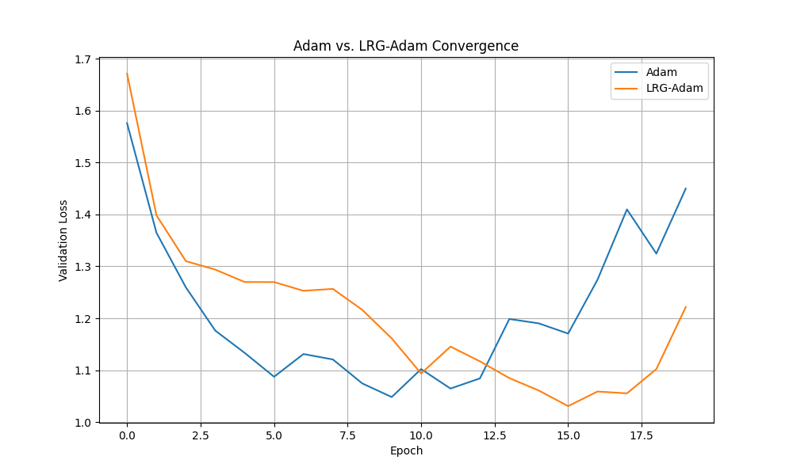

# Low-Rank Gradient Adam (LRG-Adam) Optimizer Experiment

This experiment investigates a novel optimizer, LRG-Adam, which is based on the hypothesis that the optimal weight update direction lies in a low-dimensional subspace of the full gradient space. By filtering out noise from the gradient signal, we might achieve more stable and efficient training.

## Hypothesis

Standard optimizers like Adam use the full gradient vector to update model parameters. This gradient can contain noise that might not be beneficial for convergence. The hypothesis of this experiment is that by computing a low-rank approximation of the gradients, we can filter out this noise and provide a more robust update signal to the optimizer, leading to better or faster convergence.

## Methodology

To test this hypothesis, I implemented a new PyTorch optimizer, `LRGAdam`, which wraps a standard Adam optimizer. In each optimization step, `LRGAdam` performs the following actions:

1.  **Collect and Flatten Gradients:** All model gradients are collected and flattened into a single, one-dimensional vector.
2.  **Reshape to Matrix:** The flattened vector is reshaped into a square matrix. Padding is applied if the number of parameters is not a perfect square.
3.  **Low-Rank Approximation:** Singular Value Decomposition (SVD) is performed on the gradient matrix. The singular values are then truncated by keeping only the top `k` values (where `k` is the `rank` hyperparameter) and setting the rest to zero. The matrix is then reconstructed from the modified singular values.
4.  **Restore Gradients:** The low-rank matrix is flattened back into a vector, and the gradients of the model's parameters are replaced with this new, approximated gradient.
5.  **Optimizer Step:** The internal Adam optimizer is called to perform the final parameter update using the low-rank gradients.

### Comparison Setup

The `LRGAdam` optimizer was benchmarked against the standard `Adam` optimizer on the `mnist1d` dataset. To ensure a fair comparison, the learning rate for both optimizers was tuned using Optuna over 15 trials. For `LRGAdam`, the rank of the approximation was also tuned as a hyperparameter.

-   **Dataset:** `mnist1d` (2000 training samples, 1000 test samples)
-   **Model:** A simple Multi-Layer Perceptron (MLP) with two hidden layers.
-   **Hyperparameter Tuning:** Optuna was used to find the best learning rate for Adam and the best learning rate and rank for LRG-Adam.
-   **Final Evaluation:** Both optimizers were trained for 20 epochs using their best-found hyperparameters, and their validation loss curves were plotted.

## Results

After running the hyperparameter tuning, the best parameters were found to be:
-   **Adam:** `lr = 0.0059`
-   **LRG-Adam:** `lr = 0.0064`, `rank = 20`

The convergence plot below compares the validation loss of the two optimizers during the final training run.

As the plot shows, the performance of LRG-Adam is very similar to the standard Adam optimizer. Both optimizers converge to a similar final validation loss, with Adam showing a slightly better (lower) loss in the final epochs.

## Conclusion

The results of this experiment suggest that, on the `mnist1d` dataset with this particular model architecture, applying a low-rank approximation to the gradients does not provide a significant advantage over the standard Adam optimizer. The hypothesis that filtering noise from gradients via SVD would lead to better performance is not supported by these findings. In fact, the standard Adam optimizer performed marginally better.

The overhead of computing the SVD at each step also makes the LRG-Adam optimizer computationally more expensive than Adam. Given the lack of performance improvement, the additional complexity is not justified.
