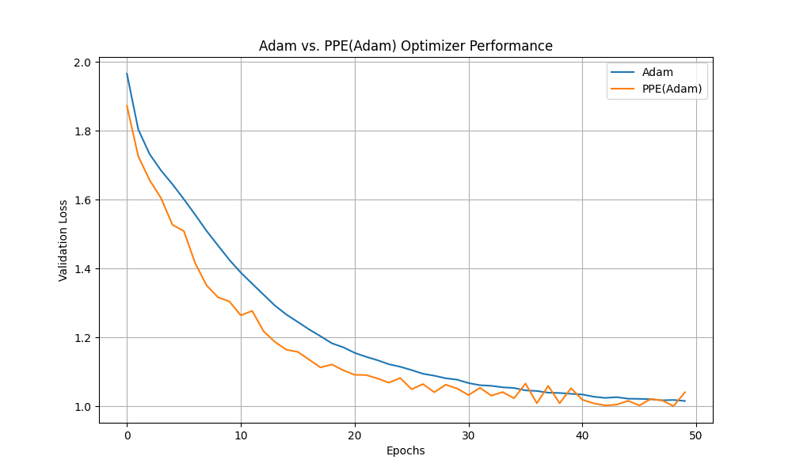

# Polynomial Parameter Extrapolation (PPE) Optimizer Experiment

This experiment investigates a novel optimizer called Polynomial Parameter Extrapolation (PPE), which aims to accelerate convergence by fitting a polynomial to the recent trajectory of each parameter and extrapolating a future position.

## Hypothesis

The core hypothesis is that we can accelerate optimizer convergence by using a simple polynomial model to predict the future position of each parameter. This extrapolated position, when combined with the update from a standard base optimizer (like Adam), should lead to faster convergence than the base optimizer alone. This is different from momentum, which is based on gradient history, not the parameter's direct trajectory.

## Methodology

1.  **Optimizer Implementation**: A PyTorch optimizer named `PPE` was implemented in `optimizer.py`. This optimizer wraps a base optimizer (in this case, `torch.optim.Adam`) and maintains a history of parameter values. In each step, it first calls the base optimizer, then fits a 2nd-degree polynomial to the last 10 values of each parameter, extrapolates the next position, and nudges the parameter towards this extrapolated position with a weighting factor `alpha=0.4`.

2.  **Comparison Setup**: The `compare.py` script was created to benchmark the performance of `PPE(Adam)` against the standard `Adam` optimizer.
    *   **Dataset**: The `mnist1d` dataset was used, with 10,000 training samples.
    *   **Model**: A simple Multi-Layer Perceptron (MLP) with one hidden layer of 128 neurons and a ReLU activation function.
    *   **Fairness**: To ensure a fair comparison, both optimizers started with the exact same initial model weights and used the same learning rate of `1e-3`.

3.  **Execution**: The script trained the model for 50 epochs with both optimizers and recorded the validation loss at the end of each epoch.

## Results

The training logs show the validation loss for both optimizers over 50 epochs. The final validation loss for Adam was ~1.015, while for PPE(Adam) it was ~1.040. The performance of both optimizers is visualized in the plot below:

As seen in the plot, the `PPE(Adam)` optimizer initially converges slightly faster in the first few epochs. However, its performance becomes more erratic and is ultimately outperformed by the standard `Adam` optimizer, which shows a much smoother convergence curve.

## Conclusion

The hypothesis that polynomial parameter extrapolation can consistently accelerate convergence is not supported by the results of this experiment. While the `PPE` optimizer showed some initial promise, its instability in later epochs suggests that simple polynomial extrapolation is not a robust method for predicting parameter trajectories. The extrapolation appears to be too sensitive to noise in the parameter's path, leading to oscillations and preventing the optimizer from settling into a good minimum.

Further research could explore more robust time-series models for extrapolation or adaptive methods for tuning the `alpha` parameter, but in its current form, the `PPE` optimizer does not offer an advantage over Adam for this task.
