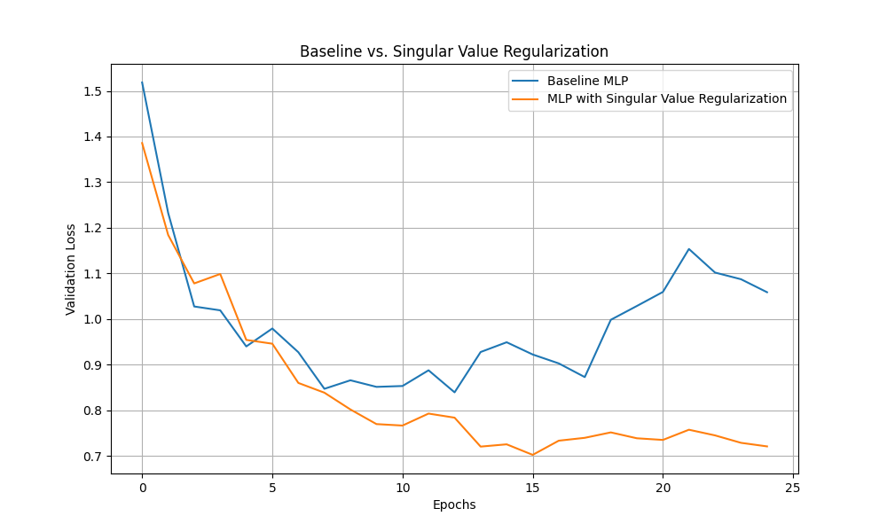

# Singular Value Regularization Experiment

This experiment investigates the effectiveness of regularizing the singular values of weight matrices in a neural network as a means of improving generalization.

## Hypothesis

Encouraging a faster decay of singular values in the weight matrices of a neural network can act as an adaptive regularization method, improving generalization by implicitly reducing the effective rank of the learned transformations. This experiment tests this hypothesis by adding a penalty proportional to the sum of the top singular values of each linear layer's weight matrix.

## Methodology

A standard Multi-Layer Perceptron (MLP) was compared against an MLP trained with the singular value regularization penalty. The `mnist1d` dataset was used for both training and validation.

To ensure a fair comparison, Optuna was used to tune the learning rate for the baseline model and both the learning rate and the regularization strength for the regularized model. The best hyperparameters from a search of 10 trials were then used to train each model for 25 epochs. The validation loss of both models was recorded at the end of each epoch.

## Results

The following plot compares the validation loss of the baseline MLP and the MLP with singular value regularization over 25 epochs.

As shown in the plot, the MLP with singular value regularization consistently achieved a lower validation loss than the baseline MLP. The regularization appears to have prevented overfitting, leading to better generalization on the test set.

## Conclusion

The results support the initial hypothesis that regularizing the singular values of the weight matrices can be an effective regularization technique. The regularized model demonstrated improved generalization compared to the baseline model, suggesting that this method warrants further investigation. Future work could explore the effect of regularizing a different number of singular values (k > 1) or applying this technique to more complex architectures and datasets.
