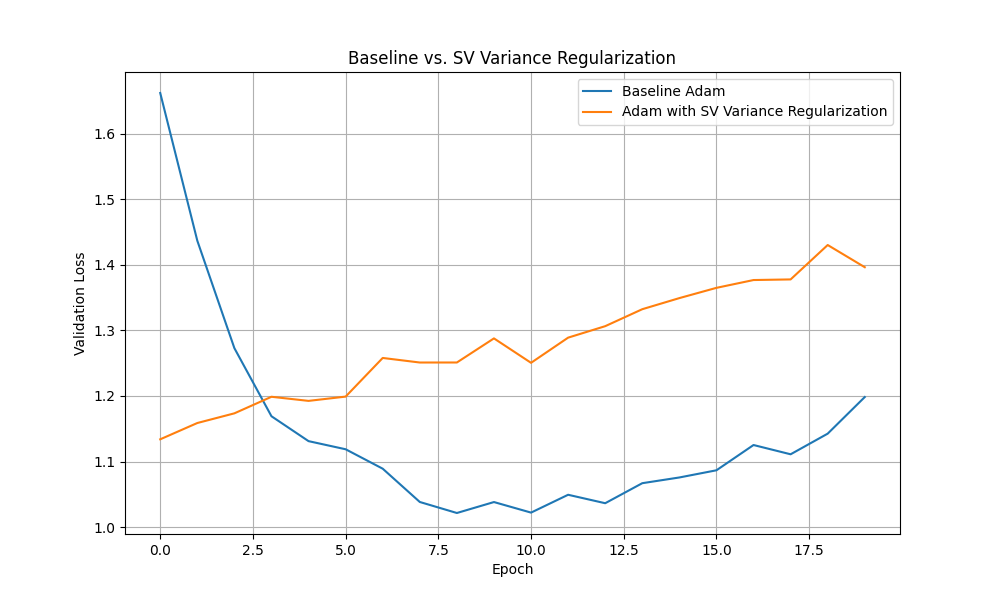

# Singular Value Variance Regularization

This experiment investigates a novel regularization technique aimed at improving model generalization by encouraging better-conditioned weight matrices.

## Hypothesis

The hypothesis is that penalizing the *variance* of the singular values of a neural network's weight matrices will encourage the singular values to be more evenly distributed. This should lead to better-conditioned matrices, a smoother loss landscape, more stable gradients during training, and ultimately, improved generalization performance compared to a standard baseline model.

## Methodology

To test this hypothesis, the following steps were taken:

1.  **Model:** A standard Multi-Layer Perceptron (MLP) with two hidden layers of 128 units each and ReLU activations was used.
2.  **Dataset:** The `mnist1d` dataset was used for both training and validation.
3.  **Regularizer:** A function was implemented to calculate the sum of the variances of the singular values for all weight matrices in the model. This penalty was added to the standard cross-entropy loss.
4.  **Fair Comparison:** To ensure a fair comparison, `optuna` was used to perform a hyperparameter search (20 trials) for both the baseline and regularized models:
    *   **Baseline:** Tuned the learning rate.
    *   **Regularized:** Tuned both the learning rate and the regularization strength.
5.  **Final Evaluation:** After finding the best hyperparameters, both models were trained from the same initial weights for 20 epochs. Their validation loss curves were recorded and plotted.

## Results

The hyperparameter search found the following optimal values:
- **Baseline Best LR:** ~0.0042
- **Regularized Best LR:** ~0.0021
- **Regularized Best Strength:** ~0.0422

The final validation losses after 20 epochs were:
- **Baseline:** 1.198
- **Regularized:** 1.396

The comparison of the validation loss curves is shown below:

As seen in the plot, the baseline model consistently achieved a lower validation loss than the model trained with singular value variance regularization. The regularizer appears to have negatively impacted the model's ability to generalize on this task.

## Conclusion

The initial hypothesis was **not supported** by the results of this experiment. Penalizing the variance of the singular values did not lead to improved performance. On the contrary, it resulted in a higher final validation loss compared to a fairly-tuned baseline, indicating that this form of regularization hindered the model's learning process on the `mnist1d` dataset.
