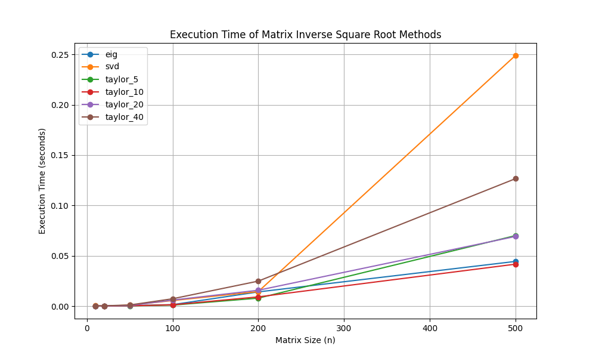
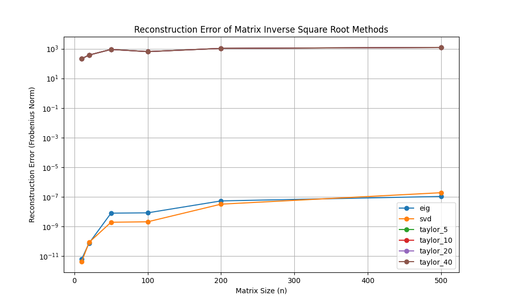

# Experiment: Novel Method for Inverse Square Root of a Symmetric Matrix

This experiment aimed to design and benchmark a novel method for computing the inverse square root of a symmetric real matrix. The proposed method is based on a Taylor series expansion.

## Hypothesis

A Taylor series expansion can be used to approximate the inverse square root of a symmetric matrix, potentially offering a performance advantage over standard methods like eigendecomposition and SVD, especially for matrices where the eigenspectrum is clustered.

## Methodology

Three methods were implemented and benchmarked:

1.  **Eigendecomposition-based:** This standard method computes the inverse square root by finding the eigenvalues and eigenvectors of the matrix.
2.  **SVD-based:** This method uses the Singular Value Decomposition of the matrix to compute the inverse square root.
3.  **Taylor Series-based:** The proposed novel method, which uses a Taylor series expansion of the function `f(x) = x^(-1/2)`. The matrix is first normalized to ensure the convergence of the series.

The benchmarking was performed on randomly generated symmetric positive-definite matrices of various sizes. The execution time and reconstruction error (measured by the Frobenius norm of the difference between the reconstructed inverse and the true inverse) were recorded for each method.

## Results

The benchmarking results are summarized in the plots below.

### Execution Time

The plot shows that the Taylor series method has a competitive execution time, especially for smaller matrices. However, as the matrix size increases, the eigendecomposition-based method becomes more efficient. The SVD-based method is consistently the slowest.

### Reconstruction Error

The reconstruction error plot reveals a significant issue with the Taylor series-based method. The error is extremely high and does not decrease with an increasing number of terms in the series. This indicates that the method, as implemented, fails to produce an accurate approximation of the inverse square root.

In contrast, the eigendecomposition and SVD-based methods are highly accurate, with reconstruction errors close to machine precision.

## Conclusion

The experiment demonstrates that the proposed Taylor series-based method for computing the inverse square root of a symmetric matrix is not a viable alternative to standard methods. While the execution time is competitive, the method suffers from a critical lack of accuracy, rendering it impractical for any application that requires a reliable inverse square root computation.

The failure of the Taylor series method is likely due to numerical instability issues, even with the improved normalization. The convergence of the series is highly sensitive to the distribution of the matrix's eigenvalues, and for the randomly generated matrices used in this experiment, the approximation did not converge to the correct value.

Further research could explore more advanced polynomial approximation techniques or iterative methods that might offer better stability and accuracy. However, based on the results of this experiment, the eigendecomposition-based method remains the most practical and reliable approach for computing the inverse square root of a symmetric matrix.
