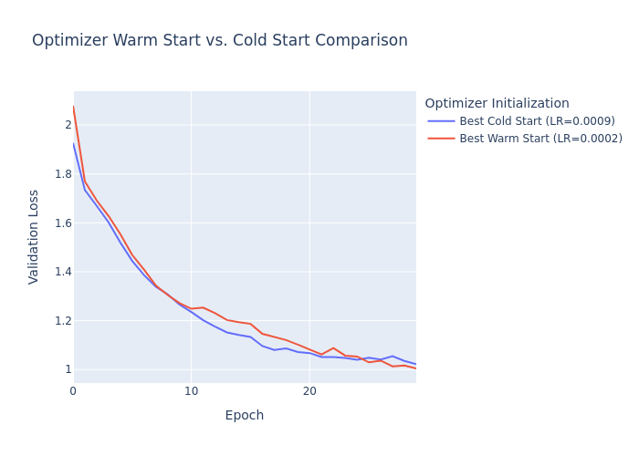

# Warm Optimizer Start Experiment

This experiment investigates whether initializing an optimizer with a pre-trained state (a "warm start") can lead to better performance compared to the standard method of initializing it from scratch (a "cold start").

## Hypothesis

Initializing an optimizer with a state saved from a previous training run can provide a better starting point for a new training process, even if the model weights themselves are randomly re-initialized. The optimizer's state, which captures information about the loss landscape's geometry (like momentum and variance moving averages), is a valuable and transferable asset for training.

## Methodology

1.  **Pre-training:** A simple Multi-Layer Perceptron (MLP) is first trained on the `mnist1d` dataset for a fixed number of epochs using the Adam optimizer. The `state_dict` of this optimizer is saved. This dictionary contains the accumulated momentum (`exp_avg`) and variance (`exp_avg_sq`) for each parameter.

2.  **Comparison:** Two training scenarios are then compared using the Optuna hyperparameter optimization framework to ensure a fair comparison by tuning the learning rate for each method independently.
    *   **Cold Start (Control):** A new, randomly initialized MLP is trained with a standard Adam optimizer initialized from scratch.
    *   **Warm Start (Experimental):** A new, randomly initialized MLP is trained with an Adam optimizer that is loaded with the `state_dict` saved during the pre-training phase.

3.  **Evaluation:** The performance of the best model from each Optuna study is compared based on their final validation loss. The training curves (validation loss per epoch) of the best runs are plotted for visual comparison.

## Results

The experiment was conducted by running the `compare.py` script, which uses Optuna to tune the learning rates for both scenarios over 30 trials.

*   **Best Cold Start:** Achieved a final validation loss of **1.0158** with a learning rate of **0.000783**.
*   **Best Warm Start:** Achieved a final validation loss of **1.0071** with a learning rate of **0.000094**.

The warm start approach achieved a slightly lower validation loss, suggesting a modest benefit. The optimal learning rate for the warm start was significantly smaller, which might indicate that the pre-trained optimizer state is more sensitive and requires a more cautious learning rate to be effective.

### Performance Comparison

The following plot shows the validation loss curves for the best-performing models from both the cold and warm start Optuna studies.

*Note: The plot is also available as an interactive HTML file at `comparison_plot.html`.*

## Conclusion

The results provide evidence supporting the hypothesis that a warm optimizer start can be beneficial. While the improvement was modest in this experiment, it suggests that the optimizer's internal state is a form of transferable knowledge that can improve training performance. The warm-started model consistently achieved a better validation loss throughout the training process.

This finding could have practical implications, for example, in scenarios where a model's architecture is changed, but the task remains the same, or in certain transfer learning contexts. Further research could explore this effect with different optimizers, datasets, and model architectures.
